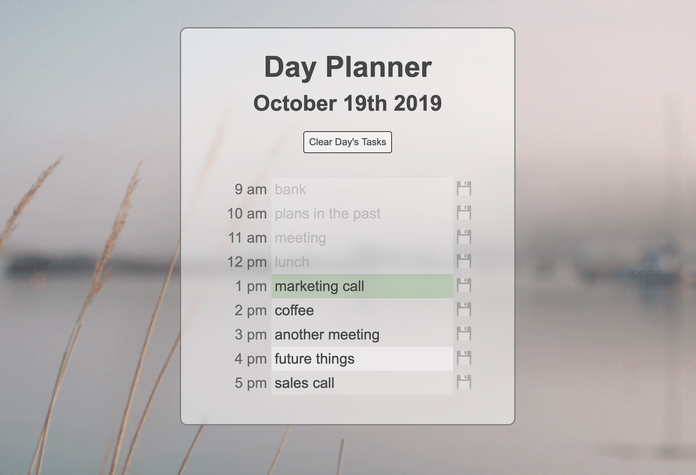

# 05-day-planner
## Unit 05 Third-Party APIs Homework: Day Planner

A responsive day planner built with HTML, CSS, Javascript, jQuery, Moment.js, and the browser's localStorage.

Live Site: https://onecheesepizza.github.io/05-day-planner/

The disk icons save indivudual records to localStorage, and the 'save all' button saves them all. 

An 'offset' URL parameter is accepted to allow testing of the planner during non-business hours.  
-5H: https://onecheesepizza.github.io/05-day-planner/?offset=-5  
-10H: https://onecheesepizza.github.io/05-day-planner/?offset=-10

